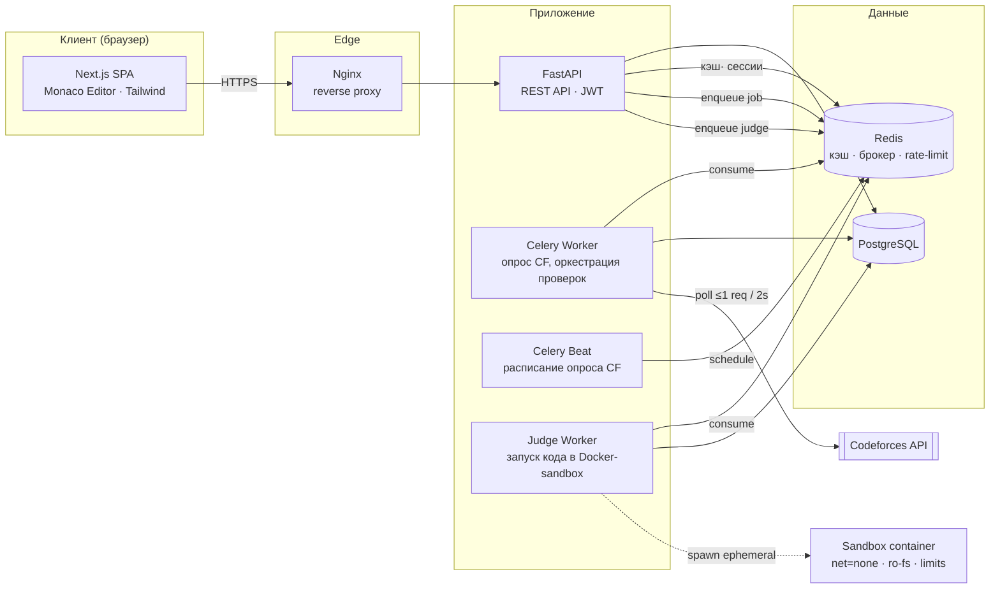
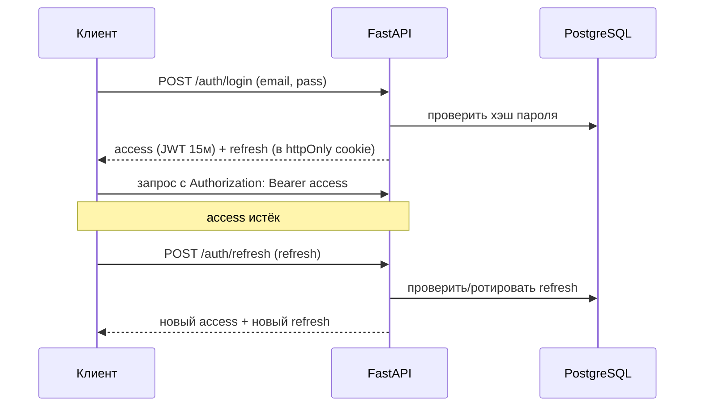
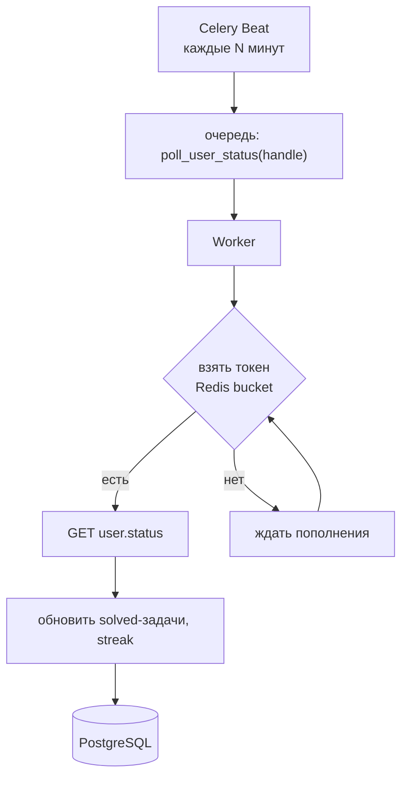
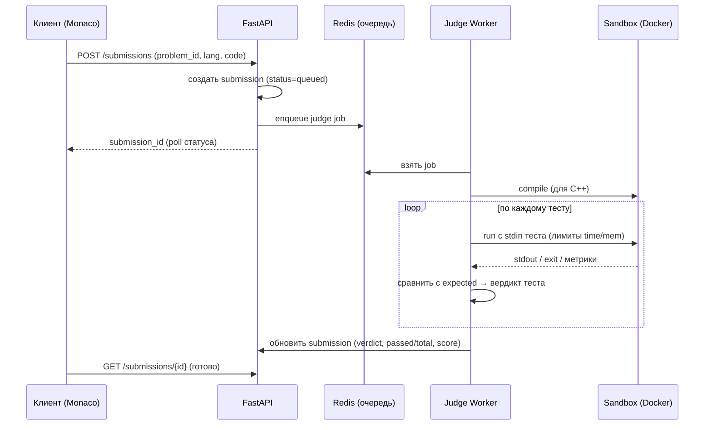

# Архитектура

Документ описывает общую архитектуру платформы: компоненты, потоки данных,
интеграцию с Codeforces, устройство изолированного sandbox и схему деплоя.
Схема базы данных вынесена в отдельный документ — [`DATABASE.md`](DATABASE.md).

## 1. Обзор

Система — это монорепозиторий из двух приложений (frontend на Next.js и backend
на FastAPI) и набора инфраструктурных сервисов (PostgreSQL, Redis, Celery,
изолированный judge для запуска пользовательского кода). Всё поднимается через
Docker Compose.

Ключевые доменные области:

1. **Auth & Profiles** — регистрация, вход, подтверждение email, роли
   (ученик/учитель), профили и группы.
2. **Textbooks** — учебники C++/Python: курс → уровень → модуль → урок,
   Markdown-контент, мини-квизы, прогресс.
3. **Codeforces & Judge** — кэш задач CF, привязка хэндла, опрос статуса,
   локальная проверка решений в sandbox.
4. **Exams** — экзамены-контесты на время (практика + теория) с серверным
   таймером и античит-сигналами.
5. **Results** — разбор результатов по темам, персональные планы подготовки,
   аналитика для учителя.

## 2. Диаграмма компонентов



## 3. Структура репозитория

```
online_programmer/
├── docker-compose.yml
├── .env.example
├── docs/
│   ├── ARCHITECTURE.md
│   ├── DATABASE.md
│   └── ROADMAP.md
├── backend/
│   ├── app/
│   │   ├── main.py                # входная точка FastAPI
│   │   ├── core/                  # config, security (JWT), зависимости
│   │   ├── db/                    # session, base, engine
│   │   ├── models/                # SQLAlchemy-модели
│   │   ├── schemas/               # Pydantic-схемы (DTO)
│   │   ├── api/                   # роутеры по доменам
│   │   │   ├── auth.py
│   │   │   ├── textbooks.py
│   │   │   ├── problems.py
│   │   │   ├── submissions.py
│   │   │   ├── exams.py
│   │   │   └── results.py
│   │   ├── services/              # бизнес-логика
│   │   │   ├── codeforces.py      # клиент CF + rate limiter
│   │   │   ├── judge.py           # оркестрация запуска в sandbox
│   │   │   ├── grading.py         # подсчёт баллов экзамена
│   │   │   └── study_plan.py      # генерация плана подготовки
│   │   └── workers/               # Celery tasks + расписание
│   ├── alembic/                   # миграции
│   ├── sandbox/                   # Dockerfile-раннеры (cpp/python), скрипты
│   └── tests/
└── frontend/
    ├── app/                       # маршруты Next.js (App Router)
    ├── components/                # UI, редактор кода, разбор результатов
    ├── lib/                       # API-клиент, auth, хелперы
    └── tests/
```

## 4. Авторизация (JWT: access + refresh)

- Пароли хранятся как bcrypt/argon2-хэши.
- **Регистрация** создаёт пользователя с `email_verified = false` и отправляет
  письмо с токеном подтверждения (`email_verification_tokens`).
- **Вход** выдаёт короткоживущий `access`-токен (JWT, ~15 мин) и долгоживущий
  `refresh`-токен (хранится хэш в `refresh_tokens`, ротация при обновлении,
  возможность отзыва).
- **RBAC**: в JWT кладётся `role` (`student` | `teacher`); на защищённых
  эндпоинтах — зависимость FastAPI, проверяющая роль.
- **Восстановление пароля**: токен в `password_reset_tokens`, одноразовый,
  с TTL.



## 5. Интеграция с Codeforces

Codeforces **не принимает** отправку решений через API, поэтому используется
гибридная модель:

- **Кэш задач.** Периодически тянем `problemset.problems`, сохраняем в БД
  (название, рейтинг, теги, ссылка). Фильтрация/подбор задач под уровень
  ученика идёт по локальному кэшу — без обращений к CF на каждый запрос.
- **Отслеживание прогресса.** Celery Beat ставит задачу опроса `user.status`
  по каждому привязанному хэндлу. Если решение принято на CF (`verdict = OK`),
  соответствующая задача помечается решённой на платформе.
- **Локальная проверка.** Ученик пишет код в Monaco Editor; решение уходит в
  наш sandbox и проверяется на тестах из условия (см. §6). Это и есть способ
  «сдать» задачу внутри платформы, независимо от CF.

### Rate limiting (1 запрос / 2 c)

Ограничение CF соблюдается через **общий распределённый token-bucket в Redis**:
любой обращающийся к CF воркер сначала берёт токен из ведра, пополняемого не
чаще чем 1 раз в 2 секунды. Так лимит держится глобально, даже при нескольких
воркерах.



## 6. Sandbox / локальный judge (приоритет — безопасность)

Пользовательский код запускается в **эфемерном Docker-контейнере**, создаваемом
на каждую проверку и уничтожаемом после. Требование ТЗ: код не должен иметь
доступа к сети и к файловой системе хоста.

**Меры изоляции:**

- `--network none` — сети нет вообще;
- `--read-only` корневая ФС + `tmpfs` только под рабочую директорию с квотой;
- без bind-mount хостовых путей; исходник кладётся внутрь через отдельный слой;
- `--memory`, `--cpus`, `--pids-limit` — лимиты памяти/CPU/числа процессов;
- ограничение wall-time и CPU-time (таймаут снаружи + `ulimit` внутри);
- запуск от непривилегированного пользователя, `--cap-drop ALL`,
  `--security-opt no-new-privileges`, seccomp-профиль;
- размер вывода ограничен (защита от «бомб» вывода).

Как альтернатива Docker — библиотека **isolate** (cgroups/namespaces), даёт
меньший оверхед на запуск; выбор фиксируется на этапе реализации judge.

**Конвейер проверки** (для C++ — компиляция `g++`, затем прогон; для Python —
запуск интерпретатора):



Вердикты: `accepted`, `wrong_answer`, `tle`, `mle`, `runtime_error`,
`compile_error`. Для экзамена начисляются **частичные баллы** за долю
пройденных тестов.

## 7. Экзамены и серверный таймер

- Экзамен — контест на время (2–3 ч): практика (3–5 задач, sandbox) + теория
  (10–20 вопросов из банка, привязанного к модулям).
- **Дедлайн считается на сервере.** При старте попытки в БД пишется
  `started_at` и `ends_at`; фронт показывает таймер, но истина — на бэкенде.
  Любой сабмит после `ends_at` отклоняется; по истечении времени попытка
  автозавершается с сохранением текущих ответов (фоновая задача-«ремайндер»
  или проверка при следующем обращении).
- **Античит (базовый):** рандомизация порядка вопросов и вариантов, разные
  варианты задач у разных учеников (материализуются в попытке), фиксация
  потери фокуса вкладки как сигнал учителю (`attempt_events`), не как автобан.
- **Пересдача:** при провале — новая попытка через N дней, со случайной
  выборкой из банка (поле `next_retake_allowed_at`).

## 8. Разбор результатов и план подготовки

После каждой попытки (сдал/провалил) считается разбивка по темам
(`attempt_topic_results`): каждый вопрос/задача привязаны к модулю учебника →
получаем карту сильных/слабых тем (тепловая карта на фронте). По слабым темам
сервис `study_plan` формирует персональный план: уроки к повторению (прямые
ссылки) + тренировочные задачи Codeforces, подобранные по тегам/рейтингу слабых
тем. История попыток даёт динамику по темам; учитель видит те же разборы и
агрегат по группе.

## 9. Деплой (Docker Compose)

Сервисы:

| Сервис | Роль |
|--------|------|
| `frontend` | Next.js (SSR/CSR) |
| `api` | FastAPI (uvicorn/gunicorn) |
| `db` | PostgreSQL |
| `redis` | кэш, брокер Celery, token-bucket для CF |
| `worker` | Celery worker (опрос CF, оркестрация) |
| `beat` | Celery beat (расписание) |
| `judge` | воркер запуска кода в sandbox (доступ к Docker-сокету/isolate) |
| `nginx` | reverse proxy, TLS-терминация, статика |

Конфигурация — через переменные окружения (`.env`), секреты не коммитятся.
Миграции БД — Alembic (применяются на старте `api` или отдельной командой).

## 10. Нефункциональные требования

- Простой, читаемый код без лишних абстракций.
- CF API — не чаще 1 запроса в 2 секунды (глобально).
- Безопасность sandbox — приоритет №1 (нет сети и доступа к ФС хоста).
- Все изменения схемы БД — через миграции Alembic.
