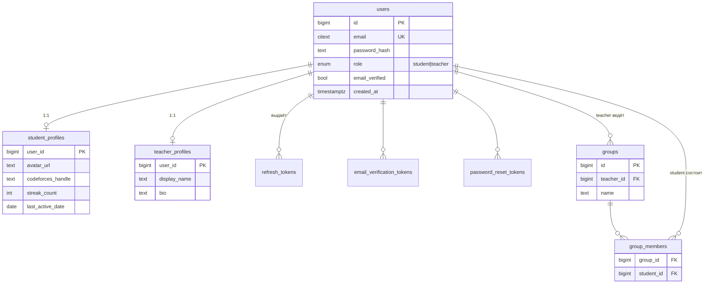
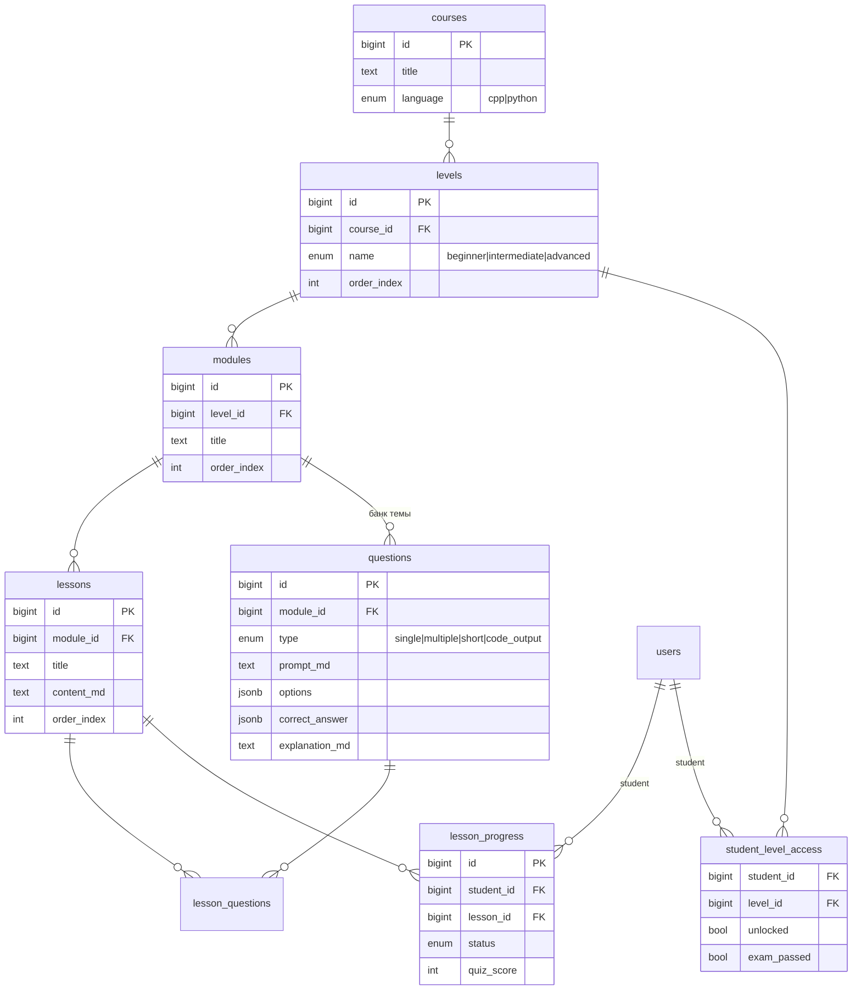
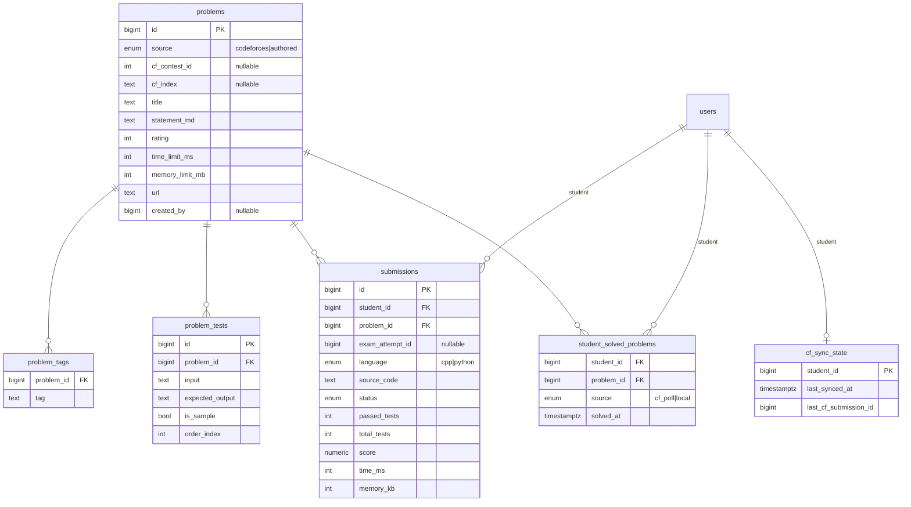
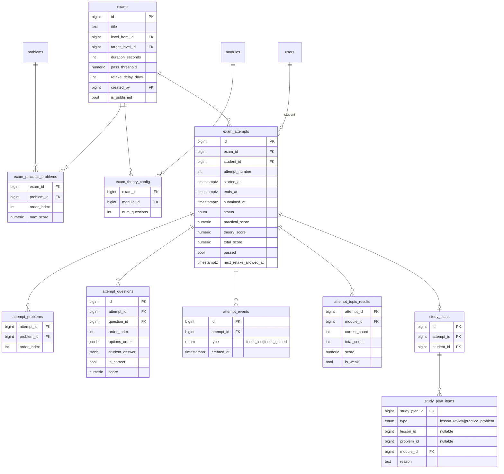

# Схема базы данных

PostgreSQL. Все изменения схемы — через миграции **Alembic**. Ниже — ER-диаграммы
по доменам и описание таблиц. Общие соглашения:

- у всех таблиц `id BIGSERIAL PRIMARY KEY` (кроме `*_profiles`, где PK = `user_id`);
- `created_at` / `updated_at` (`timestamptz`, default `now()`);
- перечисления (`enum`) реализуются как PostgreSQL `ENUM`-типы;
- денормализованные счётчики (streak и т. п.) пересчитываются в сервисном слое.

## Домен 1. Пользователи, аутентификация, группы

| Таблица | Назначение / ключевые поля |
|---------|----------------------------|
| `users` | Учётная запись. `email` (unique, citext), `password_hash`, `role` (`student`\|`teacher`), `email_verified`. |
| `student_profiles` | Профиль ученика (PK=`user_id`). `avatar_url`, `codeforces_handle`, `streak_count`, `last_active_date`. Статистика решённого считается по `student_solved_problems`. |
| `teacher_profiles` | Профиль учителя (PK=`user_id`). `display_name`, `bio`, `avatar_url`. |
| `refresh_tokens` | Активные refresh-токены: `user_id`, `token_hash`, `expires_at`, `revoked`. Ротация при обновлении. |
| `email_verification_tokens` | Подтверждение email: `user_id`, `token`, `expires_at`, `used`. |
| `password_reset_tokens` | Сброс пароля: `user_id`, `token`, `expires_at`, `used`. |
| `groups` | Группа ученика(ов) под учителем: `teacher_id`, `name`. |
| `group_members` | Связь M:N группа↔ученик: `group_id`, `student_id`, `joined_at`. Уникальна пара. |

## Домен 2. Учебники и прогресс

Иерархия: **course → level → module → lesson**. Мини-квизы уроков и банк
вопросов для экзаменов используют общую таблицу `questions`, привязанную к
модулю (модуль = «тема»).

| Таблица | Назначение / ключевые поля |
|---------|----------------------------|
| `courses` | Курс. `title`, `language` (`cpp`\|`python`), `description`. |
| `levels` | Уровень курса. `course_id`, `name` (`beginner`\|`intermediate`\|`advanced`), `order_index`. |
| `modules` | Модуль (тема) уровня. `level_id`, `title`, `order_index`. |
| `lessons` | Урок. `module_id`, `title`, `content_md` (Markdown), `order_index`, `created_by`. |
| `questions` | Единый банк вопросов темы. `module_id`, `type`, `prompt_md`, `options` (JSONB для choice), `correct_answer` (JSONB), `explanation_md`, `difficulty`. Используется и мини-квизами, и экзаменами. |
| `lesson_questions` | Какие вопросы входят в мини-квиз урока: `lesson_id`, `question_id`, `order_index`. |
| `lesson_progress` | Прогресс по уроку: `student_id`, `lesson_id`, `status` (`not_started`\|`in_progress`\|`completed`), `quiz_score`, `completed_at`. Урок пройден после квиза. |
| `student_level_access` | Доступ ученика к уровню: `student_id`, `level_id`, `unlocked`, `exam_passed`. Уровень открывается после сдачи экзамена предыдущего. |

## Домен 3. Задачи, Codeforces, сабмиты (локальный judge)

Единая таблица `problems` с дискриминатором `source` (`codeforces` | `authored`)
покрывает и кэш CF, и авторские задачи учителей. Тесты и теги — в отдельных
таблицах. Решённость складывается из опроса CF и из локальных проверок.

| Таблица | Назначение / ключевые поля |
|---------|----------------------------|
| `problems` | Задача. `source` (`codeforces`\|`authored`), для CF — `cf_contest_id`+`cf_index` (unique), `title`, `statement_md`, `rating`, `time_limit_ms`, `memory_limit_mb`, `url`, `created_by`. |
| `problem_tags` | Теги задачи (нормализованно для фильтрации): `problem_id`, `tag`. |
| `problem_tests` | Тесты задачи: `problem_id`, `input`, `expected_output`, `is_sample`, `order_index`. |
| `submissions` | Локальная отправка кода: `student_id`, `problem_id`, `exam_attempt_id` (если в рамках экзамена), `language`, `source_code`, `status` (`queued`\|`running`\|`accepted`\|`wrong_answer`\|`tle`\|`mle`\|`runtime_error`\|`compile_error`), `passed_tests`/`total_tests`, `score`, `time_ms`, `memory_kb`. |
| `student_solved_problems` | Факт решения задачи: `student_id`, `problem_id`, `source` (`cf_poll`\|`local`), `solved_at`. Уникальна пара (student, problem). |
| `cf_sync_state` | Курсор опроса CF на ученика: `last_synced_at`, `last_cf_submission_id` — чтобы не тянуть повторно. |

## Домен 4. Экзамены, результаты, планы подготовки

Экзамен задаёт правила (какие задачи, из каких тем сколько вопросов, время,
порог). Каждая **попытка** материализует конкретный рандомизированный вариант
(разные задачи/вопросы/порядок у разных учеников). Разбор по темам и план
подготовки считаются из ответов попытки.

| Таблица | Назначение / ключевые поля |
|---------|----------------------------|
| `exams` | Экзамен. `title`, `level_from_id`, `target_level_id`, `duration_seconds`, `pass_threshold` (доля, напр. 0.70), `retake_delay_days`, веса практика/теория, `created_by`, `is_published`. |
| `exam_practical_problems` | Практические задачи экзамена: `exam_id`, `problem_id`, `order_index`, `max_score`. |
| `exam_theory_config` | Правила теории: из модуля `module_id` брать `num_questions` случайных вопросов. |
| `exam_attempts` | Попытка. `exam_id`, `student_id`, `attempt_number`, `started_at`, **`ends_at` (серверный дедлайн)**, `submitted_at`, `status` (`in_progress`\|`submitted`\|`timed_out`\|`graded`), баллы `practical/theory/total`, `passed`, `next_retake_allowed_at`. |
| `attempt_problems` | Задачи, назначенные конкретной попытке (вариант ученика): `attempt_id`, `problem_id`, `order_index`. Практические сабмиты — в `submissions.exam_attempt_id`. |
| `attempt_questions` | Материализованные теор-вопросы попытки: `attempt_id`, `question_id`, `order_index`, `options_order` (рандомизация вариантов), `student_answer`, `is_correct`, `score`. |
| `attempt_events` | Античит-сигналы: `attempt_id`, `type` (`focus_lost`\|`focus_gained`\|…), `created_at`. |
| `attempt_topic_results` | Разбор по темам: `attempt_id`, `module_id`, `correct_count`/`total_count`, `score`, `is_weak`. Основа тепловой карты. |
| `study_plans` | Персональный план подготовки к пересдаче: `attempt_id`, `student_id`. |
| `study_plan_items` | Пункт плана: `type` (`lesson_review`\|`practice_problem`), `lesson_id` **или** `problem_id`, `module_id`, `reason`. Ссылки на уроки по слабым темам + тренировочные задачи CF. |

## Индексы и ограничения (ключевые)

- `users.email` — UNIQUE (citext).
- `problems (cf_contest_id, cf_index)` — UNIQUE для `source='codeforces'`.
- `student_solved_problems (student_id, problem_id)` — UNIQUE.
- `group_members (group_id, student_id)` — UNIQUE.
- `lesson_progress (student_id, lesson_id)` — UNIQUE.
- `submissions (student_id, created_at)` — индекс для истории/дашборда.
- `problem_tags (tag)` и `problems (rating)` — индексы для подбора задач.
- FK с `ON DELETE` продумываются per-table (напр. каскад для `attempt_*` при
  удалении попытки, `RESTRICT` для справочников).
